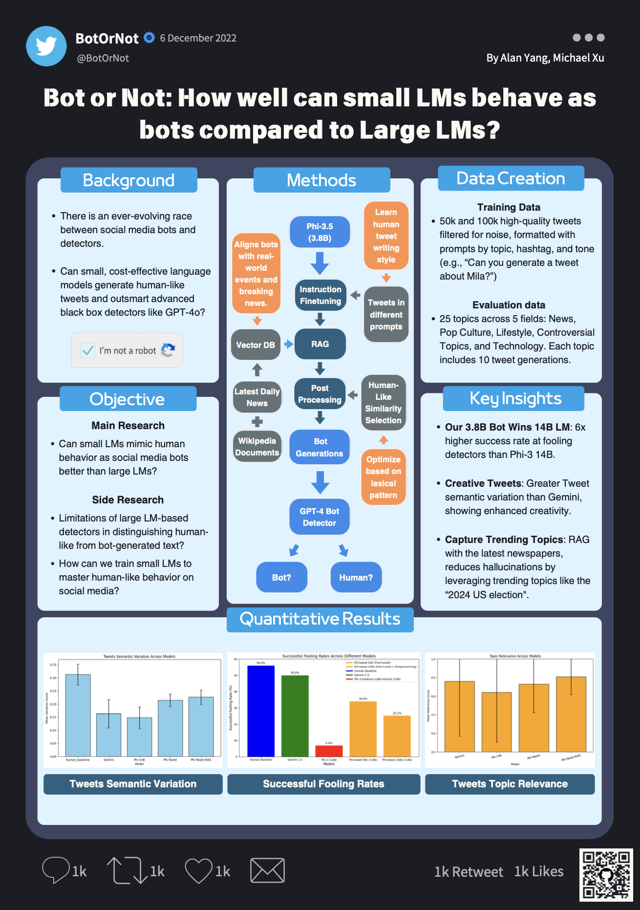

# Bot or Not: How well can small LMs behave as bots compared to Large LMs?

In the ever-evolving race between social media bots and detectors, one crucial question remains: can detectors reliably distinguish between human-written content and bot-generated text? If bots can deceive detectors, there is a significant risk of spreading false or misleading information. In this study, we simulate this competition by testing our small language model, Phi-3.5-mini-instruct, combined with techniques such as instruction tuning, Retrieval-Augmented Generation (RAG), and post-processing, can generate tweets that are indistinguishable from human-written content. We challenge this against a much capable model, GPT-4, acting as the detector. If the Small Language Model (SLM) can deceive the much larger one, it would not only prove the prevalence of low-cost undetected social media bots, but it could also provide insights into improving detection systems based on vulnerabilities exposed by this attack. Our research aims to bridge the gap between model size and performance, testing whether smaller, cost-effective models can rival their larger counterparts in generating high-quality, human-like text. This study could shed light on the “Bot or Not” dilemma, offering novel solutions for social media in the ongoing battle against bots.

# Retrieval-Augmented Generation with Wikipedia and Breaking news

RAG plays a key role in improving the relevance of tweet generation. We build a vector database using Wikipedia as the foundation documents, and to keep the model informed with the latest news, we scrape articles daily from various sources. As trending tweet topics change daily, we aim to explore whether RAG can help the model integrate up-to-date information and generate tweets that are not only human-like but also more relevant and realistic to confuse the detector further, particularly when addressing specific topics or breaking news.

# Project Poster

Below is the poster summarizing our project and key findings:



# Specification of dependencies
Install the libraries:
```
pip install -r requirements.txt
```

# Training code
Notebooks inside the /model folder.

# Evaluation code
Detector.ipynb.

# Pre-trained models
Two tuned models released in Huggingface.

Tuned with 50k high quality tweets:
https://huggingface.co/AlanYky/phi-3.5_tweets_instruct_50k

Tuned with 100k raw tweets:
https://huggingface.co/AlanYky/phi-3.5_tweets_instruct

# How to reproduce the results
1. Run /model/tweets-instruct-tuning/tweet_instruct_50k.ipynb and model/tweets-instruct-tuning/tweet_instruct_100k.ipynb to reproduce two models.
2. Run /Detector.ipynb to reproduce candidates model performance comparison.
3. Run /model/lexical-distribution-post-processing/post_processing_human_like_selection.ipynb to reproduce post-processing pipeline.
3. Run all notebooks inside /analysis folder to reproduce the analysis for the generated tweets.


# Acknowledgement
Thanks https://newscatcherapi.com/ for free news access.
